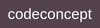

# Mon traqueur d'apprentissage

Un journal complet de mes compétences en développement Web, mon apprentissage, mes ressources, mes centres d'intérêt et tout ce qui concerne mon apprentissage. C'est un moyen de suivre, d'organiser et de partager mes apprentissages.

 😄 :smile: [Mon portfolio complet](https://github.com/sandix34/Mon-traqueur-d-apprentissage)

## Compétences

[done]: https://user-images.githubusercontent.com/29199184/32275438-8385f5c0-bf0b-11e7-9406-42265f71e2bd.png "Done"

|               Compétence              | 1 Introduction | 2 Bases   | 3 bien     | 4 très bien | 5 confiante | 6 génial    |
|:-------------------------------- |:-----------------:|:-------------:|:-------------:|:----------------:|:--------------:|:---------------:|
|** HTML5**                         | ![done][done]     | ![done][done] | ![done][done] | ![done][done]    | ![done][done]  |                 |
|** CSS3**                          | ![done][done]     | ![done][done] | ![done][done] | ![done][done]    | ![done][done]  |                 |
|** JavaScript**                    | ![done][done]     | ![done][done] | ![done][done] |                  |                |                 |
|** ES6**                           | ![done][done]     | ![done][done] |               |                  |                |                 |
|** React**                         | ![done][done]     |  ![done][done]             |               |                  |                |                 |
|** Redux**                         | ![done][done]                  |               |               |                  |                |                 |        |
|** Git**                           | ![done][done]     | ![done][done] | ![done][done] |                  |                |                 |        |
|** GitHub**                        | ![done][done]     | ![done][done] | ![done][done] | ![done][done]    | ![done][done]               |                 |        |
|** Webpack 4**                       | ![done][done]     | ![done][done] |    ![done][done]           |                  |                |                 |
|** Agile**                         | ![done][done]     |               |               |                  |                |                 |        |
|** Travailler avec des API**             | ![done][done]     |  ![done][done]             |               |                  |                |                 |
|** jQuery**                        | ![done][done]     | ![done][done] |               |                  |                |                 |
|**Css Grid & Flex-box**           | ![done][done]     | ![done][done] | ![done][done] | ![done][done]    |                |                 |
|**Responsive design**             | ![done][done]     | ![done][done] | ![done][done] |                  |                |                 |
|**Mobile first**                  | ![done][done]     | ![done][done] |               |                  |                |                 |        |
|** Markdown**                      | ![done][done]     | ![done][done] | ![done][done] | ![done][done]    |                |                 |
|**Construction de site Web**      | ![done][done]     | ![done][done] |               |                  |                |                 |
|**Déployer un site web**          | ![done][done]     |             |               |                  |                |                 |
|** Bootstrap**                     | ![done][done]     | ![done][done] | ![done][done] |                  |                |                 |
|** Ligne de commande**             | ![done][done]     | ![done][done] | ![done][done] |                  |                |                 |
|** Node.js**                       |                   |               |               |                  |                |                 |
|** NPM**                           | ![done][done]     | ![done][done] |   ![done][done]            |               ![done][done]   |                |                 |        |
|** SQL**                           | ![done][done]     | ![done][done] | ![done][done] |                  |                |                 |
|** MySQL**                         | ![done][done]     | ![done][done] | ![done][done] |                  |                |                |
|** OpenLayers**                    | ![done][done]     | ![done][done] |  |                  |                |                |
|** Sass**                    | ![done][done]     | ![done][done] |  |                  |                |                |
|** PHP**                    | ![done][done]     | ![done][done] |  |                  |                |                |
|** AJAX**                    | ![done][done]     | ![done][done] |  |                  |                |                |
|**Formik & Yup**                    | ![done][done]     | ![done][done] |  |                  |                |                |
|**Axios**                    | ![done][done]     |![done][done]  |  |                  |                |                |

----
## Apprentissage

[//]: # (Status images)

[Completed]: https://user-images.githubusercontent.com/29199184/32275438-8385f5c0-bf0b-11e7-9406-42265f71e2bd.png "Completed"
[In Progress]: https://user-images.githubusercontent.com/29199184/34462881-7305ddac-ee4d-11e7-9b57-589424820da4.png "In Progress"
[Soon]: https://user-images.githubusercontent.com/29199184/34462916-d5c37bd4-ee4d-11e7-9f4a-d57f2243281b.png "Soon"

|            Status           |   Année   | Cours                                                          |                Lien                        |
|:---------------------------:|:---------|:----------------------------------------------------------------|:-------------------------------------------:|
| ![Soon][Soon] |  2019       | Formation en ligne NodeJs     |  |
| ![Soon][Soon] |  2019       | Créez une Interface de WebMapping avancée de A à Z |  |
| ![In Progress][In Progress] | Mai 2019       | Apprendre le WebMapping avec OpenLayers|  |
| ![Completed][Completed] |   Avril 2019      | Formation en ligne Webpack 4      |  |
| ![Completed][Completed] |   Avril 2019      | Formation en ligne Redux les bases      |  |
| ![Completed][Completed] | Avril 2019       | Formation en ligne React | |
| ![Completed][Completed]     | Avril 2019       | Préparation en ligne et certification « Maîtrise de la qualité en projet web » | 
| ![Completed][Completed]     | Mars 2019        | Développement moderne Javascript et ES6, ES7 | |
| ![Completed][Completed]     | Février 2019     | Vraiment bien comprendre javascript |  |
| ![Completed][Completed]     | Février 2019     | AdminSys, Introduction à Symfony, React et Wordpress |   |
| ![Completed][Completed]     | Janvier 2019     | Introduction au framework Lumen |   |
| ![Completed][Completed]     | Janvier 2019     | AJAX, JSON, API, jQuery, MCD(Modèle Conceptuel de Données), MLD(Modèle Logique de Données)                                          |   |
| ![Completed][Completed]     | Décembre 2018    | MVC (Modèle-Vue-Contôleur), Composeur, Héritage, POO, SEO, Modélisation de la BDD, Agile  |  |
| ![Completed][Completed]     | Décembre 2018    | Gestion de projet, MySQL, SQL, phpMyAdmin, POO avec PHP, Bootstrap |     |
| ![Completed][Completed]     | Novembre 2018    | JavaScript ES5  |   |
| ![Completed][Completed]     | Novembre 2018    | PHP, Templating |    |
| ![Completed][Completed]     | Novembre 2018    | Intégration, HTML5, CSS3, Git, Github, Slack, Vscode, Chrome,Intégration, Flexbox, Css Grid, ResponsiveWeb Design |      |

----

## Intérêts

Je suis actuellement intéressé par:

+  React
+ :earth_africa: webmapping avec OpenLayers

----

## Ressources

+ :fr: [les meilleurs développeurs web Français sur YouTube...](https://www.ledevweb.fr/) de [Jérémy Mouzin](https://www.javascriptdezero.com/#10)
+ :us: [Manuel du developpeur front end 2019](https://frontendmasters.com/books/front-end-handbook/2019/#1) de  [Cody Lindley](http://codylindley.com/)
+  :fr: [Veille technologique pour les développeurs web](https://thewhale.cc/) de [Gilles Vauvarin](https://thewhale.cc/about)

----

### Liste de contrôle de développement Web

Voici une liste d'objectifs de base à atteindre sur le chemin de la maîtrise du développement Web.

Cette liste est une copie presque exacte de [ Ginny Fahs](https://twitter.com/ginnyfahs) [ "Things Real Developers Do: My Bucket List"](https://blog.prototypr.io/wondering-if-youre-a-real-developer-yet-try-making-a-bucket-list-281275482155)

* [x] Ouvrrir le terminal de l'ordinateur
* [x] Utilisez un éditeur de texte (Vscode)
* [x] Utilisez des raccourcis clavier
* [ ] Écrire des tests pour votre code
* [ ] Aidez un autre développeur Web à résoudre un problème
* [ ] Assistez à un événement sur le développement Web
* [x] Suivre les développeurs que l'on admire sur les médias sociaux
* [ ] Lire un livre sur le codage
* [x] Ouvrir la console de votre navigateur
* [x] Obtenir des données d'une API
* [ ] Masquer les clés API du public
* [ ] Posez une question sur Stack Overflow
* [x] Code Push vers GitHub
* [ ] Parlez de quelque chose lié au développement web lors d'un événement
* [ ] Remplir un entretien technique
* [ ] Participer à un hackathon
* [ ] Déployer un projet
* [ ] Contribuer à l'open source
* [ ] Soyez payé pour coder
* [x] Lorsque les gens vous demandent ce que vous faites, répondez en disant que vous êtes développeur :)
* [x] Travailler en Pair Programming

